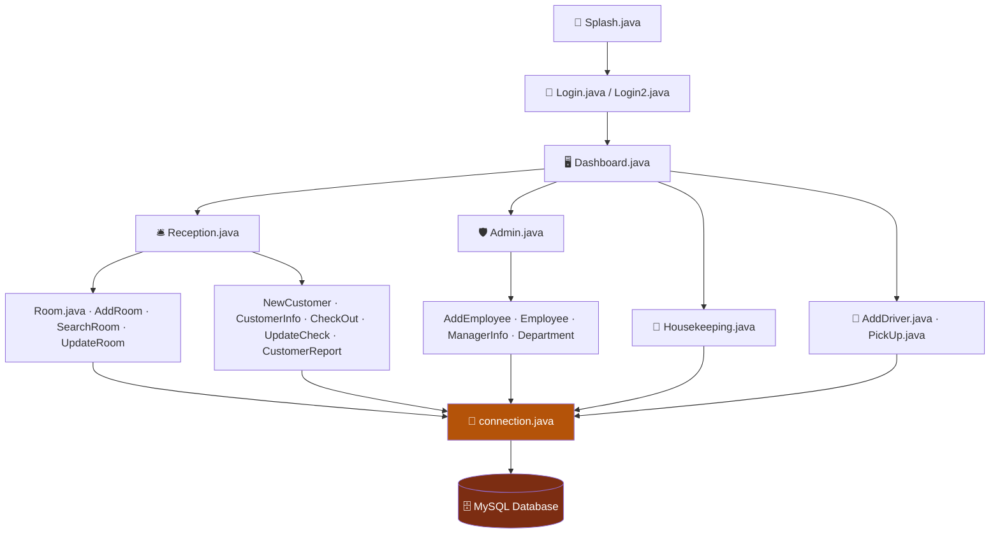

<div align="center">


<br/>

[](https://www.oracle.com/java/)
[](https://docs.oracle.com/javase/tutorial/uiswing/)
[](https://www.mysql.com/)
[](#-license)

[](https://github.com/Crusty-chirayu/Hotel-Management-System/stargazers)
[](https://github.com/Crusty-chirayu/Hotel-Management-System/forks)
[](#-contributing)

</div>

---

## 🔑 Legend

| Symbol | Meaning |
|:---:|---|
| ✅ | Confirmed — a real `.java` file in the repo implements this |
| 🚧 | Planned — listed in [Future Improvements](#-future-improvements), not yet in the codebase |
| `TODO` | Not confirmed during this review — verify before relying on it |

---

## 📌 Overview

**Hotel Management System** is a desktop application that runs the operational core of a small hotel — not just bookings. Front desk, staff records, housekeeping, and guest transport all live in one Java Swing GUI backed by MySQL, with zero cloud dependency and zero per-seat SaaS fees.

It replaces four separate spreadsheets (guests, staff, housekeeping, pickups) with one structured app any front-desk PC can run.

<br/>

## 📚 Table of Contents

- [Live Preview](#-live-preview)
- [Features](#-features)
- [Module Status](#-module-status)
- [Tech Stack](#️-tech-stack)
- [Architecture](#️-architecture)
- [Screenshots](#️-screenshots)
- [Prerequisites](#-prerequisites)
- [Installation & Setup](#-installation--setup)
- [Usage](#️-usage)
- [Project Structure](#-project-structure)
- [Security Notes](#-security-notes)
- [Future Improvements](#-future-improvements)
- [Contributing](#-contributing)
- [FAQ](#-faq)
- [Author](#-author)
- [License](#-license)


## ✨ Features

> Grouped by the real modules present in the codebase — not a generic feature list. Every row below maps to an actual `.java` file.

### 🛎️ Front Desk & Room Operations
| Feature | Source |
|---|---|
| Add / search / update rooms | `AddRoom.java`, `SearchRoom.java`, `UpdateRoom.java`, `Room.java` |
| New customer registration & customer records | `NewCustomer.java`, `CustomerInfo.java` |
| Check-out & stay updates | `CheckOut.java`, `UpdateCheck.java` |
| Customer / booking reports | `CustomerReport.java` |
| Reception desk view | `Reception.java` |

### 👥 Staff & HR
| Feature | Source |
|---|---|
| Add & manage employees | `AddEmployee.java`, `Employee.java` |
| Department structure | `Department.java` |
| Manager records | `ManagerInfo.java` |
| Admin controls | `Admin.java` |

### 🧹 Housekeeping & 🚐 Transport
| Feature | Source |
|---|---|
| Housekeeping task tracking | `Housekeeping.java` |
| Driver registry | `AddDriver.java` |
| Guest pickup coordination | `PickUp.java` |

### 🖥️ App Shell
| Feature | Source |
|---|---|
| Splash screen | `Splash.java` |
| Login (dual login paths) | `Login.java`, `Login2.java` |
| Central dashboard | `Dashboard.java` |
| MySQL connectivity layer | `connection.java` |

<sub>💡 This is a materially bigger feature set than a typical "rooms + check-in" hotel demo — the staff/HR, housekeeping, and transport modules above weren't called out in earlier drafts of this README even though the code for them already exists.</sub>

<br/>

## 📊 Module Status

<div align="center">

| Module | Status |
|---|:---:|
| Front desk (rooms, customers, checkout) | ✅ |
| Staff / HR management | ✅ |
| Housekeeping | ✅ |
| Driver & pickup coordination | ✅ |
| Login & dashboard shell | ✅ |
| Multi-role authentication | 🚧 |
| PDF / Excel reporting | 🚧 |
| Modernized theming (FlatLaf) | 🚧 |
| Email notifications | 🚧 |

</div>

<br/>

## 🛠️ Tech Stack

<div align="center">

[](https://www.oracle.com/java/)
[](https://www.mysql.com/)
[](https://www.jetbrains.com/idea/)
[](https://netbeans.apache.org/)

</div>

| Layer | Technology |
|---|---|
| **Language** | Java |
| **GUI Framework** | Java Swing |
| **Database** | MySQL |
| **DB Driver** | MySQL Connector/J 8.0.28 — bundled directly in the repo (`mysql-connector-java-8.0.28.jar`), no separate download needed |
| **IDE (confirmed)** | IntelliJ IDEA — `HMS.iml` project file is checked into the repo |
| **IDE (also works)** | NetBeans / Eclipse |
| **License** | MIT — `LICENSE` file present in repo |

<br/>

## 🏗️ Architecture



<sub>Reconstructed from the files present in the repository, not a documented architecture diagram from the source — module boundaries (e.g. exactly which classes call `connection.java` directly vs. through an intermediary) are `TODO` to confirm against the source.</sub>

<br/>

## 🖼️ Screenshots

<div align="center">


<br/><br/>

**Bonus assets already in the repo, not previously shown:**


</div>

<br/>

## 📋 Prerequisites

- ☑️ **Java JDK 11+** installed
- ☑️ **MySQL Server** installed and running
- ☑️ An IDE — **IntelliJ IDEA** (project file included), NetBeans, or Eclipse

<br/>

## 🚀 Installation & Setup

**1. Clone the repository**
```bash
git clone https://github.com/Crusty-chirayu/Hotel-Management-System.git
```

**2. Open the project**
Open the folder directly in **IntelliJ IDEA** (it already has `HMS.iml`), or import it as a Java project into NetBeans/Eclipse.

**3. Set up the database**
> ⚠️ **Honesty check:** no `.sql` schema file was found in the repository's top-level listing at the time this README was written. Either it lives somewhere not shown in the root listing, or it still needs to be added/exported. Confirm this before following the step below — if there's no schema file, export one from your local database once the tables referenced by `connection.java` and the model classes are created, and commit it so this step is reproducible for the next person.

- Create a MySQL database matching what `connection.java` expects
- Import the schema (`.sql` file) once its location is confirmed

**4. Configure the connection**
Open `connection.java` and update the host, port, username, password, and database name to match your local MySQL setup.

**5. Run the project**
> `TODO`: no `Main.java` appears in the repository's root file listing. `Splash.java` is the most likely entry point given the naming pattern (splash screen → login → dashboard), but confirm which class holds `public static void main(String[] args)` before documenting this as fact.

Run the confirmed entry-point class from your IDE — the application window should launch immediately.

<br/>

## 🖱️ Usage

Once the application is running:

- ➕ Add new customers and assign rooms
- 🔄 Manage check-ins and check-outs
- 👥 Add employees, assign departments, and manage manager records
- 🧹 Track housekeeping tasks
- 🚐 Register drivers and coordinate guest pickups
- 📊 View all bookings and customer details in a structured table
- ✏️ Edit or delete records as needed

<br/>

## 📁 Project Structure

```
Hotel-Management-System/
├── Splash.java                     # App entry screen
├── Login.java / Login2.java        # Authentication (two variants)
├── Dashboard.java                  # Central navigation hub
├── Admin.java                      # Admin controls
├── Reception.java                  # Front desk view
├── Room.java / AddRoom.java / SearchRoom.java / UpdateRoom.java
├── NewCustomer.java / CustomerInfo.java / CustomerReport.java
├── CheckOut.java / UpdateCheck.java
├── AddEmployee.java / Employee.java / ManagerInfo.java / Department.java
├── Housekeeping.java
├── AddDriver.java / PickUp.java
├── connection.java                 # MySQL connectivity
├── mysql-connector-java-8.0.28.jar # Bundled DB driver
├── HMS.iml                         # IntelliJ project file
├── LICENSE                         # MIT
└── README.md
```

<sub>⚠️ Everything currently sits at the repository root with no package structure — flagged below under [Future Improvements](#-future-improvements) as a maintainability opportunity, not a bug.</sub>

<br/>

## 🔐 Security Notes

- `connection.java` holds the MySQL connection details — confirm whether host/username/password are hardcoded or externalized. If hardcoded, that's the first thing to fix before this touches any shared or production database.
- `TODO`: confirm whether queries use `PreparedStatement` (parameterized) or raw string-concatenated SQL — the latter would be a SQL-injection risk across the customer, employee, and room modules.
- Only one authentication path is confirmed (`Login.java` / `Login2.java`); role-based access control (admin vs. staff) is listed under [Future Improvements](#-future-improvements) rather than confirmed as implemented today.

<br/>

## 🔮 Future Improvements

- [ ] 📄 PDF / Excel report generation for bookings
- [ ] 🔐 Multiple staff roles with authentication
- [ ] 🎨 Modernized GUI with updated Swing themes / FlatLaf
- [ ] 📧 Email notifications for bookings and check-outs
- [ ] 📦 Organize source into packages (`ui/`, `db/`, `model/`) instead of a flat file layout
- [ ] 🗄️ Commit the database schema (`.sql`) to the repo so setup is reproducible
- [ ] 🧾 Clarify/rename the entry-point class so `Getting Started` doesn't require guessing
- [ ] 🔒 Externalize DB credentials out of `connection.java` (config file / environment variables)

<br/>

## 🤝 Contributing

Pull requests are welcome. For larger changes, open an issue first to discuss direction.

1. Fork the repository
2. Create your feature branch (`git checkout -b feature/your-feature`)
3. Commit your changes (`git commit -m 'Add your feature'`)
4. Push to the branch (`git push origin feature/your-feature`)
5. Open a Pull Request

<br/>

## ❓ FAQ

**Is this only for room bookings?**
No — it also covers staff/HR records, housekeeping tracking, and guest pickup coordination. See [Features](#-features).

**Does it need internet access to run?**
No — it's fully offline once Java and a local MySQL server are set up.

**Which class do I actually run to start the app?**
Not confirmed in this README — see the note under [Installation & Setup](#-installation--setup). `Splash.java` is the best current guess based on naming convention.

**Is there a hosted demo?**
No — it's a desktop application. See [Live Preview](#-live-preview) for a real GIF capture instead.

<br/>

## 👤 Author

<div align="center">

**Chirayu Jayaswal**

[](https://github.com/Crusty-chirayu)
[](https://linkedin.com/in/chirayu-jayaswal)
[](https://portfolio-lac-kappa-49.vercel.app)

</div>

<br/>

## 📄 License

MIT — see [`LICENSE`](LICENSE) for details.

<div align="center">

⭐ **If this project helped you, consider giving it a star!** ⭐

<sub>No star-history chart here on purpose — GitHub has been restricting third-party access to stargazer history data, which breaks those charts. A static star count badge (above) doesn't depend on that endpoint, so it's used instead.</sub>


</div>
